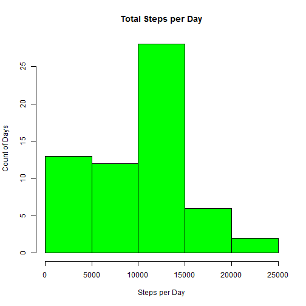
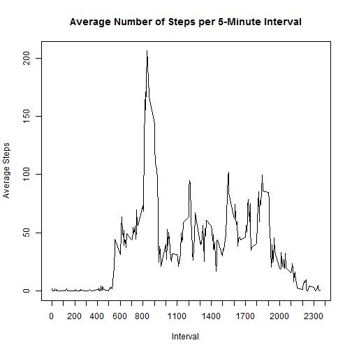
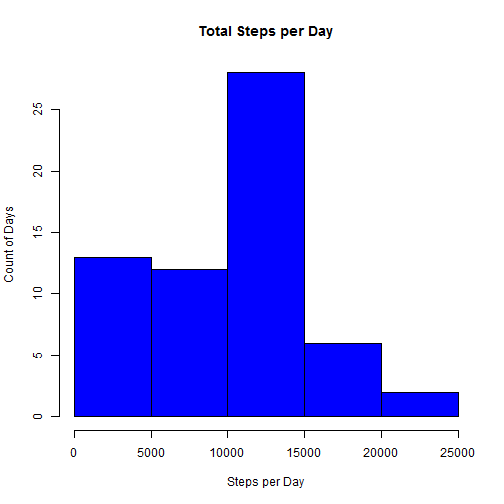
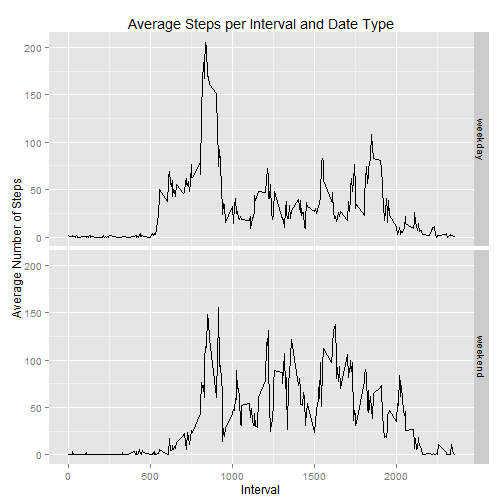

Loading and Processing the Data
---
Show any code that is needed to:

1. Load the data (i.e. read.csv())
2. Process/transform the data (if necessary) into a format suitable for your analysis


```r
## Read in data.  
  data <- read.csv("activity.csv")

## Convert date values from factor to date.
  data$date <- as.Date(data$date)
```
---

What is the mean total number of steps taken per day?
---

For this part of the assignment, you can ignore the missing values in the dataset.

1. Make a histogram of the total number of steps taken each day.

```r
## Sum total steps by day.
  sumSteps <- aggregate(data$steps, by=list(data$date), FUN=sum, na.rm=TRUE)
    names(sumSteps) <- c("Day","Steps")

## Plot histogram.
  hist(sumSteps$Steps, main = "Total Steps per Day", xlab = "Steps per Day", ylab = "Count of Days", col = "green")
```

 

2. Calculate and report the mean and median total number of steps taken per day.

The mean number of steps per day is 9354.2295082.

The median number of steps per day is 10395.

---

What is the average daily activity pattern?
---

1. Make a time series plot (i.e. type = "l") of the 5-minute interval (x-axis) and the average number of steps taken, averaged across all days (y-axis).


```r
## Calculate means.
  meanSteps <- aggregate(data$steps, by=list(data$interval), FUN=mean, na.rm=TRUE)
    names(meanSteps) <- c("Interval","AvgSteps")

## Create time-series plot.
  with(meanSteps, plot(Interval, AvgSteps, main = "Average Number of Steps per 5-Minute Interval", xlab = "Interval", ylab = "Average Steps", type = "l", xaxt="n"))
		axis(1, at=c(seq(from=0,to=2500,by=100)))
```

 

2. Which 5-minute interval, on average across all the days in the dataset, contains the maximum number of steps?


```r
## Identify the row with the maximum number of steps.
  maxrow <- which.max(meanSteps[,2] )
```

835 is the interval with the maximum number of steps.

---

Imputing missing values
---

Note that there are a number of days/intervals where there are missing values (coded as NA). The presence of missing days may introduce bias into some calculations or summaries of the data.

1. Calculate and report the total number of missing values in the dataset (i.e. the total number of rows with NAs)


```r
sum(is.na(data$steps))
```

```
## [1] 2304
```

2. Devise a strategy for filling in all of the missing values in the dataset. The strategy does not need to be sophisticated. For example, you could use the mean/median for that day, or the mean for that 5-minute interval, etc.


```r
## Calculate the median number of steps for each interval.
  medInt <- aggregate(data$steps, by=list(data$interval), FUN=median, na.rm=TRUE)
    names(medInt) <- c("interval","steps")

## Subset rows containing NA steps and non-NA steps.
  subNA <- data[!complete.cases(data[,1]),]
  subOK <- data[complete.cases(data[,1]),]	

## Replace NAs by merging the median filler value into the subset and preparing a new data frame with just the needed new columns.
  subNA2 <- merge(subNA,medInt,by="interval")
  subNA3 <- subset(subNA2, select = c(interval,steps.y,date))
    names(subNA3) <- c("interval", "steps","date")
```

3. Create a new dataset that is equal to the original dataset but with the missing data filled in.


```r
## Combine corrected NA rows with original non-NA rows.
  CorData <- rbind(subNA3,subOK)
```

4. (a) Make a histogram of the total number of steps taken each day 


```r
## Sum total steps by day.
  sumnewSteps <- aggregate(CorData$steps, by=list(CorData$date), FUN=sum, na.rm=TRUE)
    names(sumnewSteps) <- c("Day","Steps")
		
## Plot histogram.
  hist(sumnewSteps$Steps, main = "Total Steps per Day", xlab = "Steps per Day", ylab = "Count of Days", col = "blue")
```

 

4. (b) Calculate and report the mean and median total number of steps taken per day. Do these values differ from the estimates from the first part of the assignment? What is the impact of imputing missing data on the estimates of the total daily number of steps?

The imputed mean number of steps per day is 9503.8688525.  That is a difference of -149.6393443.

The imputed median number of steps per day is 10395.  That is a difference of 0.

There is minimal impact from imputing the missing data on the estimates of total daily steps.

---

Are there differences in activity patterns between weekdays and weekends?
---

For this part the weekdays() function may be of some help here. Use the dataset with the filled-in missing values for this part.

1. Create a new factor variable in the dataset with two levels -- "weekday" and "weekend" indicating whether a given date is a weekday or weekend day.


```r
## Add weekdays to the CorData table
  CorData$day <-weekdays(CorData$date)
	
## Assign factor to CorData in a new column.
  CorData$DateType <- ifelse(CorData$day == "Saturday" | CorData$day == "Sunday" , "weekend","weekday")
    CorData$DateType <- as.factor(CorData$DateType)
```

2. Make a panel plot containing a time series plot (i.e. type = "l") of the 5-minute interval (x-axis) and the average number of steps taken, averaged across all weekday days or weekend days (y-axis). 


```r
## Calculate the average steps by weekday/weekend.
  avgSteps <- aggregate(CorData$steps, by=list(CorData$interval, CorData$DateType), FUN=mean, na.rm=TRUE)
    names(avgSteps) <- c("Interval","Group","AvgSteps")

## Create facet plot.
  library(ggplot2)
  p <- qplot(Interval, AvgSteps, data = avgSteps, geom = "line")
	p + facet_grid(Group~.) + labs(title = "Average Steps per Interval and Date Type", x = "Interval", y = "Average Number of Steps") 
```

 

